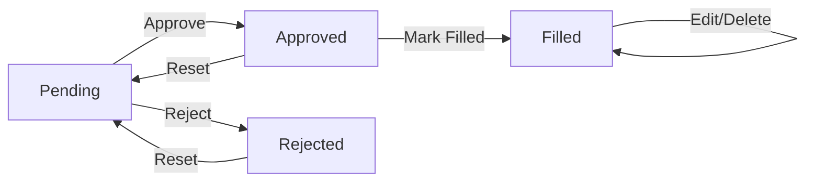

# 📦 FTS Stock Management System

> A simple and elegant needs/stock management system built with Laravel, Livewire, and Breeze authentication.

[](https://laravel.com)
[](https://livewire.laravel.com)
[](https://php.net)

## ✨ Features

- 🔐 **Authentication** - Simple login/register with Laravel Breeze
- ➕ **Add Needs** - Quick form to input stock requirements
- 📊 **Dashboard** - View all needs with real-time updates
- 🔍 **Smart Filters** - Filter by status, month, and year
- 🚦 **Status Workflow** - Pending → Approved → Filled
- ✏️ **Inline Edit** - Edit filled items directly in the table
- 🗑️ **Delete** - Remove filled items when no longer needed
- 📥 **Excel Export** - Download filtered reports instantly
- ⚡ **Real-time UI** - No page refresh needed (thanks to Livewire!)

## 🎯 Status Flow



**Status Actions:**
- **Pending**: Approve ✓ | Reject ✗
- **Approved**: Mark as Filled ✓ | Reset ↻
- **Rejected**: Reset ↻
- **Filled**: Edit ✎ | Delete 🗑

## 🚀 Quick Start

### Prerequisites

- PHP 8.2 or higher
- Composer
- Node.js & NPM
- SQLite/MySQL/PostgreSQL

### Installation

1. **Clone the repository**
   ```bash
   git clone https://github.com/Mifta24/FTS-Stock.git
   cd FTS-Stock
   ```

2. **Install dependencies**
   ```bash
   composer install
   npm install
   ```

3. **Environment setup**
   ```bash
   cp .env.example .env
   php artisan key:generate
   ```

4. **Configure database**
   
   Edit `.env` file:
   ```env
   DB_CONNECTION=sqlite
   # Or use MySQL/PostgreSQL
   # DB_CONNECTION=mysql
   # DB_HOST=127.0.0.1
   # DB_PORT=3306
   # DB_DATABASE=fts_stock
   # DB_USERNAME=root
   # DB_PASSWORD=
   ```

5. **Run migrations**
   ```bash
   php artisan migrate
   ```

6. **Seed dummy data (optional)**
   ```bash
   php artisan db:seed
   ```
   
   This creates:
   - Admin user: `admin@fts.com` / `password`
   - 6 sample needs with various statuses

7. **Build assets**
   ```bash
   npm run build
   # Or for development
   npm run dev
   ```

8. **Start the server**
   ```bash
   php artisan serve
   ```

9. **Open your browser**
   
   Navigate to: `http://localhost:8000`

## 📱 Usage

### Adding a Need

1. Login to your account
2. Click **"Add Need"** in the navigation
3. Fill in the form:
   - Item Name (required)
   - Quantity & Unit (required)
   - Estimated Price (optional)
   - Needed Date (required)
   - Description & Notes (optional)
4. Click **"Save Need"**
5. Data appears instantly in Dashboard!

### Managing Needs

#### Dashboard View
- View all needs in a sortable table
- Filter by:
  - Status: All | Pending | Approved | Rejected | Filled
  - Month: All months or specific month
  - Year: Current year or previous years

#### Status Actions
- **Pending Items**: Approve or Reject
- **Approved Items**: Mark as Filled or Reset to Pending
- **Filled Items**: Edit details or Delete permanently
- **Rejected Items**: Reset to Pending

#### Exporting Data
- Click **"📥 Export Excel"** button
- Downloads Excel file with filtered data
- Includes all item details, status, and dates

### Inline Editing

For items with **Filled** status:
1. Click **"✎ Edit"** button
2. Row changes to edit mode (blue background)
3. Modify item details directly
4. Click **"✓ Save"** or **"✗ Cancel"**

## 🛠️ Tech Stack

- **Backend**: Laravel 11.x
- **Frontend**: Blade Templates + Livewire 3.x
- **Styling**: Tailwind CSS
- **Authentication**: Laravel Breeze
- **Export**: Maatwebsite Excel
- **Database**: SQLite/MySQL/PostgreSQL

## 📦 Key Packages

```json
{
  "laravel/framework": "^11.0",
  "laravel/breeze": "^2.3",
  "livewire/livewire": "^3.7",
  "maatwebsite/excel": "^3.1"
}
```

## 📁 Project Structure

```
FTS-Stock/
├── app/
│   ├── Exports/
│   │   └── NeedsExport.php      # Excel export logic
│   ├── Livewire/
│   │   ├── NeedForm.php         # Add need component
│   │   └── NeedTable.php        # Dashboard table component
│   └── Models/
│       └── Need.php             # Need model
├── database/
│   ├── migrations/
│   │   └── *_create_needs_table.php
│   └── seeders/
│       └── DatabaseSeeder.php   # Dummy data
├── resources/
│   └── views/
│       ├── livewire/
│       │   ├── need-form.blade.php
│       │   └── need-table.blade.php
│       ├── dashboard.blade.php
│       └── input.blade.php
└── routes/
    └── web.php
```

## 🎨 Screenshots

### Dashboard


### Add Need Form


### Inline Edit


## 🤝 Contributing

Contributions are welcome! Please feel free to submit a Pull Request.

1. Fork the repository
2. Create your feature branch (`git checkout -b feature/AmazingFeature`)
3. Commit your changes (`git commit -m 'Add some AmazingFeature'`)
4. Push to the branch (`git push origin feature/AmazingFeature`)
5. Open a Pull Request

## 📄 License

This project is open-sourced software licensed under the [MIT license](https://opensource.org/licenses/MIT).

## 👤 Author

**Mifta24**

- GitHub: [@Mifta24](https://github.com/Mifta24)
- Repository: [FTS-Stock](https://github.com/Mifta24/FTS-Stock)

## 💡 Support

If you found this project helpful, please give it a ⭐️!

---

<p align="center">Made with ❤️ using Laravel & Livewire</p>


We would like to extend our thanks to the following sponsors for funding Laravel development. If you are interested in becoming a sponsor, please visit the [Laravel Partners program](https://partners.laravel.com).

### Premium Partners

- **[Vehikl](https://vehikl.com)**
- **[Tighten Co.](https://tighten.co)**
- **[Kirschbaum Development Group](https://kirschbaumdevelopment.com)**
- **[64 Robots](https://64robots.com)**
- **[Curotec](https://www.curotec.com/services/technologies/laravel)**
- **[DevSquad](https://devsquad.com/hire-laravel-developers)**
- **[Redberry](https://redberry.international/laravel-development)**
- **[Active Logic](https://activelogic.com)**

## Contributing

Thank you for considering contributing to the Laravel framework! The contribution guide can be found in the [Laravel documentation](https://laravel.com/docs/contributions).

## Code of Conduct

In order to ensure that the Laravel community is welcoming to all, please review and abide by the [Code of Conduct](https://laravel.com/docs/contributions#code-of-conduct).

## Security Vulnerabilities

If you discover a security vulnerability within Laravel, please send an e-mail to Taylor Otwell via [taylor@laravel.com](mailto:taylor@laravel.com). All security vulnerabilities will be promptly addressed.

## License

The Laravel framework is open-sourced software licensed under the [MIT license](https://opensource.org/licenses/MIT).
